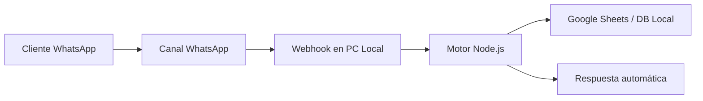
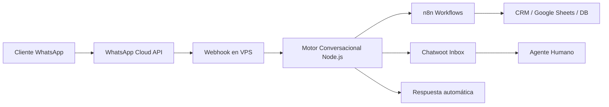

# WhatsApp Chatbot Profesional  
### Solución de Automatización Escalable para Negocios

[](https://business.whatsapp.com/)
[](https://nodejs.org/)
[]
[]

---

## Descripción General

Sistema profesional de automatización sobre WhatsApp Business diseñado para:

- Atención automática 24/7  
- Captura estructurada de leads  
- Envío automatizado de información  
- Escalamiento a agente humano  
- Integración con herramientas externas  

La arquitectura es modular y permite evolucionar desde un modelo básico local hasta una infraestructura cloud empresarial.

---

# Problema que Resuelve

Muchos negocios:

- Responden manualmente las mismas consultas.
- Pierden mensajes fuera de horario.
- No registran datos de clientes.
- No tienen métricas de conversión.

Este sistema automatiza y estructura la comunicación para convertir conversaciones en datos accionables.

---

# Flujo de Automatización Base

## Escenario de Conversación

Cliente escribe:
```text
Hola
```

Respuesta automática:
```text
👋 Bienvenido.
¿Cómo podemos ayudarte?

1️⃣ Ver servicios
2️⃣ Solicitar presupuesto
3️⃣ Hablar con asesor
```

Si el cliente selecciona “Solicitar presupuesto”:
```text
Perfecto, necesito algunos datos:

📌 Nombre:
📌 Servicio de interés:
📌 Ciudad:
```

## El sistema:

- Valida información
- Registra datos en base
- Notifica al vendedor
- Envía confirmación automática

```text
✅ Gracias. Un asesor te contactará en breve.
```

---

# Modelos de Implementación

El sistema puede desplegarse en dos modalidades técnicas.

---

# 🖥️ 1️⃣ Modalidad Local (Self-Hosted)

Implementación instalada en una computadora del cliente que permanece encendida 24/7 con conexión estable.

## Arquitectura



## Características

- Node.js ejecutándose localmente
- Webhook expuesto con IP pública o túnel seguro
- Registro en Google Sheets o base local

## Ventajas

- Bajo costo inicial
- Ideal para pruebas o MVP

## Limitaciones

- Dependencia de conexión doméstica
- Riesgo ante cortes eléctricos
- Escalabilidad limitada

# ☁️ 2️⃣ Modalidad Cloud (VPS + API Oficial)

Arquitectura profesional desplegada en servidor VPS utilizando:

- WhatsApp Cloud API
- Chatwoot
- n8n
- Base de datos externa

Arquitectura Completa

# Componentes
WhatsApp Cloud API

- Canal oficial aprobado
- Manejo de plantillas
- Ventana de conversación de 24 horas

VPS

- Servidor Linux
- PM2 o Docker
- Certificado SSL

n8n

- Automatización avanzada
- Integraciones con APIs externas

Chatwoot

- Bandeja de entrada multicanal
- Asignación de agentes
- Historial completo

# Comparativa Técnica
| Característica | Modalidad Local    | Modalidad Cloud        |
| -------------- | ------------------ | ---------------------- |
| Costo Inicial  | Bajo               | Medio                  |
| Disponibilidad | Depende del equipo | Alta (24/7)            |
| Escalabilidad  | Limitada           | Alta                   |
| Seguridad      | Básica             | Profesional            |
| Integraciones  | Básicas            | Avanzadas              |
| Ideal para     | Negocio pequeño    | Empresa en crecimiento |


# Escalabilidad

El sistema puede evolucionar hacia:

- Gestión automática de reservas
- Dashboard de métricas
- Integración con IA
- Integración con CRM
- Omnicanal completo

Seguridad y Buenas Prácticas

- Validación de Webhooks
- Manejo de rate limits
- Protección de tokens en variables de entorno
- Logging estructurado
- Control de errores y reintentos

# Enfoque Profesional

No es un bot aislado.
Es una arquitectura de automatización escalable sobre infraestructura segura que permite:

- Profesionalizar la atención
- Centralizar conversaciones
- Convertir mensajes en datos
- Escalar sin rehacer el sistema